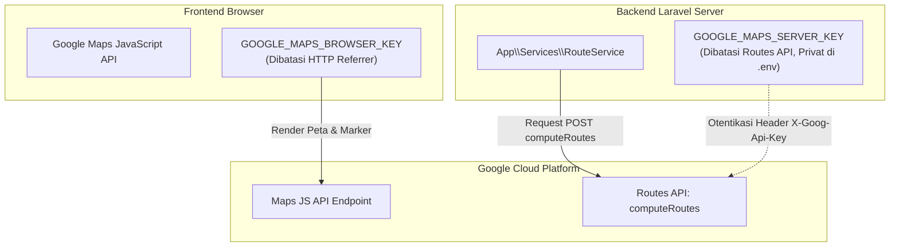

# Dokumentasi Integrasi API Eksternal (API & Integration Guide)
**Proyek:** Website Layanan Private Tour Bali (Jumu Bali Tour MVP)  
**Versi:** 1.0.0-MVP (Cluster 17)  
**Layanan Terintegrasi:** Google Maps Platform (Maps JS API & Routes API) & WhatsApp Click-to-Chat  

---

## 1. Arsitektur Pemisahan Kunci API Google Maps

Untuk mematuhi prinsip keamanan standar industri (*Defense in Depth*), aplikasi memisahkan kunci API Google Maps menjadi dua bagian:



---

## 2. Google Maps JavaScript API (Frontend)
- **Fungsi:** Merender peta interaktif, kontrol zoom, marker jemput (hijau 'P'), dan marker destinasi wisata (merah nomor '1'..'5') di peramban pengguna.
- **Variabel Environment:** `GOOGLE_MAPS_BROWSER_KEY`.
- **Penerapan Restriksi:**
  - **Application Restriction:** *Websites (HTTP referrers)*.
  - **Daftar Domain Diizinkan:**
    - `https://domain-anda.example/*`
    - `http://127.0.0.1:8000/*` (untuk pengujian lokal)
- **Graceful Fallback:** Jika kunci API tidak terisi atau peramban gagal memuat pustaka Google Maps, sistem otomatis beralih ke *Mode Rute Berbasis Daftar* tanpa merusak antarmuka atau fungsi kalkulasi.

---

## 3. Google Routes API (Backend Server-to-Server)
- **Fungsi:** Menghitung jarak riil jalan raya (meter), durasi tempuh (detik), dan decoded/encoded polyline dari titik penjemputan ke seluruh destinasi wisata.
- **Variabel Environment:** `GOOGLE_MAPS_SERVER_KEY` / `GOOGLE_ROUTES_API_KEY`.
- **Endpoint:** `POST https://routes.googleapis.com/directions/v2:computeRoutes`.
- **Header Khusus:**
  - `Content-Type: application/json`
  - `X-Goog-Api-Key: {GOOGLE_MAPS_SERVER_KEY}`
  - `X-Goog-FieldMask: routes.distanceMeters,routes.duration,routes.polyline.encodedPolyline,routes.legs`
  *(Field mask secara eksplisit membatasi response hanya pada data yang dibutuhkan, menghemat bandwidth dan biaya API)*.
- **Parameter Payload JSON:**
  ```json
  {
    "origin": { "location": { "latLng": { "latitude": -8.7481, "longitude": 115.1672 } } },
    "destination": { "location": { "latLng": { "latitude": -8.6212, "longitude": 115.0868 } } },
    "intermediates": [
      { "location": { "latLng": { "latitude": -8.7185, "longitude": 115.1686 } } }
    ],
    "travelMode": "DRIVE",
    "routingPreference": "TRAFFIC_AWARE",
    "computeAlternativeRoutes": false,
    "languageCode": "id-ID",
    "units": "METRIC"
  }
  ```
- **Penanganan Error:**
  - Timeout request disetel maksimal 10 detik.
  - Tanggapan error HTTP 400, 403 (kuota habis/invalid key), atau 500 ditangkap secara elegan oleh `RouteService` dan mengembalikan pesan ramah pengguna tanpa membocorkan kunci API ke respons JSON.

---

## 4. WhatsApp Click-to-Chat Integration
- **Protokol:** Tautan standar `wa.me` tanpa ketergantungan API pihak ketiga berbayar:
  ```text
  https://wa.me/{nomor_telepon_internasional}?text={pesan_ter_encode}
  ```
- **Normalisasi Nomor Kontak ([`WhatsAppService.php`](file:///h:/Template%20Project/jumu_tour/app/Services/WhatsAppService.php)):**
  - Mengubah awalan lokal Indonesia `08...` menjadi format internasional `628...`.
  - Membersihkan karakter spasi, tanda hubung (`-`), tanda kurung, dan tanda plus (`+`).
- **Template Pesan Terstruktur:**
  Pesan otomatis disusun dari data server yang tervalidasi:
  ```text
  Halo Admin Bali Tour Service, saya ingin memesan private tour:

  *Rincian Pemesan:*
  - Nama: Budi Santoso
  - No. WA: 08123456789
  - Tanggal Tour: 25 September 2026
  - Jumlah Penumpang: 4 Orang

  *Rencana Rute Perjalanan:*
  - Titik Jemput: Bandara Ngurah Rai
  - Tujuan 1: Pantai Kuta
  - Tujuan 2: Tanah Lot

  *Estimasi Perjalanan:*
  - Total Jarak: 45.2 km
  - Estimasi Durasi: 2 Jam 15 Menit
  - Estimasi Biaya Sewa: Rp650.000 (Estimasi)

  Mohon konfirmasi ketersediaan armada dan jadwal. Terima kasih.
  ```
- **Prinsip Keamanan:** Pesan tidak dikirim secara otomatis; pengguna harus menekan tombol kirim sendiri pada antarmuka aplikasi WhatsApp miliknya.
