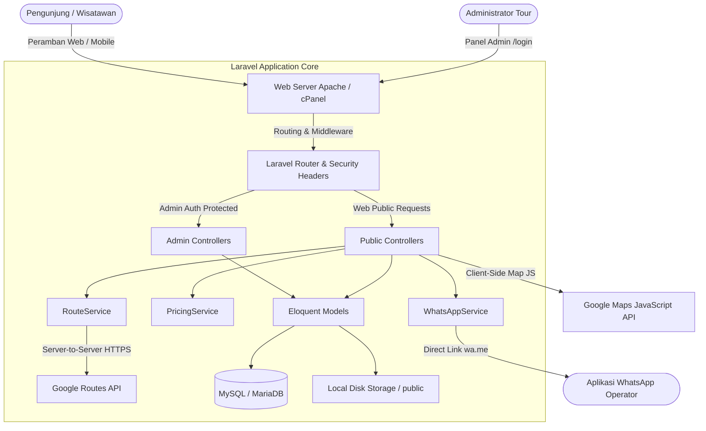
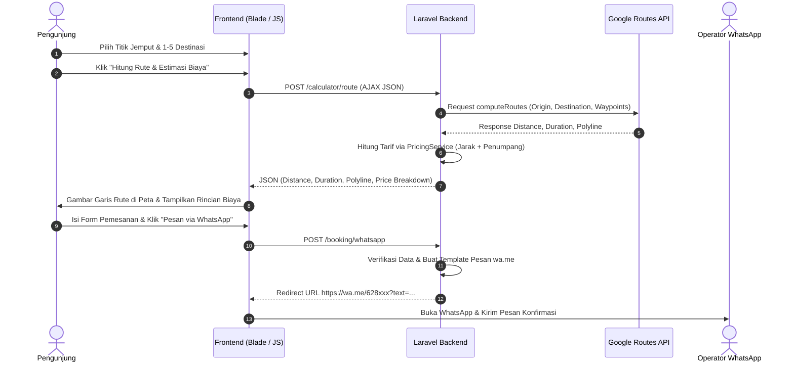

# Gambaran Umum Sistem (System Overview)
**Proyek:** Website Layanan Private Tour Bali (Jumu Bali Tour MVP)  
**Versi:** 1.0.0-MVP (Cluster 17)  
**Tujuan Arsitektur:** Platform kalkulator rute dan pemesanan private tour Bali yang ringan, transparan, aman, dan mudah di-deploy pada shared hosting Apache cPanel.  

---

## 1. Tujuan Sistem
Sistem ini dibangun untuk memecahkan kendala umum wisatawan yang ingin menyewa mobil atau private tour di Bali:
1. **Transparansi Rute & Jarak:** Memberikan kebebasan kepada wisatawan untuk merancang runtutan tempat wisata (1 hingga 5 destinasi) dan melihat visualisasi rute riil jalan raya pada peta Google Maps.
2. **Kalkulasi Biaya Terbuka:** Menyajikan estimasi harga sewa berbasis formula jarak dan jumlah penumpang secara transparan sebelum pemesanan dilakukan.
3. **Pemesanan Cepat Tanpa Registrasi Rumit:** Menghubungkan wisatawan langsung dengan operator tour melalui WhatsApp Click-to-Chat dengan format pesan yang sudah memuat rincian lengkap rute perjalanan.
4. **Pengelolaan Data Terpusat bagi Admin:** Memungkinkan pengelola tour untuk mengelola katalog tempat wisata, daerah, kategori, tarif dasar, dan identitas brand secara mandiri melalui panel admin yang aman.

---

## 2. Aktor Sistem
1. **Pengunjung / Calon Wisatawan (Public User):**
   - Menjelajahi katalog destinasi, daerah, dan kategori wisata di Bali.
   - Menggunakan kalkulator rute untuk memilih titik jemput dan menyusun hingga 5 destinasi.
   - Menghitung rute, total jarak (km), durasi perjalanan, dan estimasi biaya.
   - Mengisi formulir pemesanan dan melanjutkan konfirmasi ke WhatsApp operator.
2. **Administrator Tour (Admin User):**
   - Mengelola master data daerah wisata (CRUD Region).
   - Mengelola kategori wisata (CRUD Category).
   - Mengelola tempat wisata, koordinat geografis, upload foto, dan status aktif (CRUD Destination).
   - Memantau ringkasan statistik sistem melalui dashboard administrator.

---

## 3. Arsitektur Sistem

Aplikasi dibangun menggunakan pola arsitektur **Model-View-Controller (MVC)** berbasis framework **Laravel 12** yang disederhanakan (*lightweight monolith*) agar ramah terhadap lingkungan shared hosting:

---

## 4. Modul-Modul Aplikasi
1. **Modul Brand Identity & Layout Publik:** Mengatur metadata situs, nama brand, kontak, dan skema tema warna yang di-injeksikan secara aman via `BrandViewComposer`.
2. **Modul Katalog Wisata (Daerah, Kategori, Destinasi):** Menampilkan direktori wisata Bali dengan query optimal (bebas N+1) dan pagination Bootstrap 5.
3. **Modul Kalkulator Rute & Peta:** Antarmuka interaktif yang memadukan Google Maps JS di frontend dengan endpoint kalkulasi rute di backend.
4. **Modul Pricing & Estimasi Biaya:** Layanan kalkulasi tarif (`PricingService`) berbasis konfigurasi aktif, jarak rute, dan jumlah penumpang dengan pembulatan ke kelipatan Rp1.000 terdekat.
5. **Modul WhatsApp Click-to-Chat:** Generator tautan resmi `wa.me` dengan normalisasi nomor internasional dan sanitasi template pesan.
6. **Modul Autentikasi & Keamanan Admin:** Sistem proteksi login tunggal dengan rate limiting anti brute-force, regenerasi sesi, dan token CSRF.
7. **Modul CRUD Administrasi:** Antarmuka pengelolaan data daerah, kategori, destinasi, dan manajemen file foto.

---

## 5. Alur Data Perjalanan Wisata (User Journey Data Flow)

---

## 6. Integrasi Eksternal
1. **Google Maps JavaScript API (Frontend):** Digunakan semata-mata untuk merender peta interaktif dan marker lokasi di sisi peramban. API Key dibatasi dengan *HTTP Referrer Restriction*.
2. **Google Routes API (Backend Server-to-Server):** Digunakan di sisi server Laravel untuk menghitung jarak nyata jalan raya dan durasi tempuh. API Key tersimpan secara privat di `.env` server.
3. **WhatsApp Click-to-Chat (Stateless Protocol):** Menghasilkan URL standar `https://wa.me/{phone}?text={encoded_message}`. Tidak memerlukan integrasi WhatsApp Business Cloud API berbayar.

---

## 7. Batasan Ruang Lingkup MVP (Known Boundaries)
- **Tanpa Payment Gateway:** Tidak ada sistem pembayaran online atau dompet digital (pembayaran disepakati langsung via WhatsApp).
- **Tanpa Akun Pelanggan:** Pengunjung tidak perlu registrasi atau login untuk merencanakan rute.
- **Tanpa Database Booking:** Data pemesanan tidak disimpan ke database (*stateless booking*) guna mematuhi prinsip privasi data MVP.
- **Tanpa Optimasi Rute Otomatis:** Urutan destinasi sepenuhnya ditentukan secara manual oleh pengguna (Naik/Turun).
